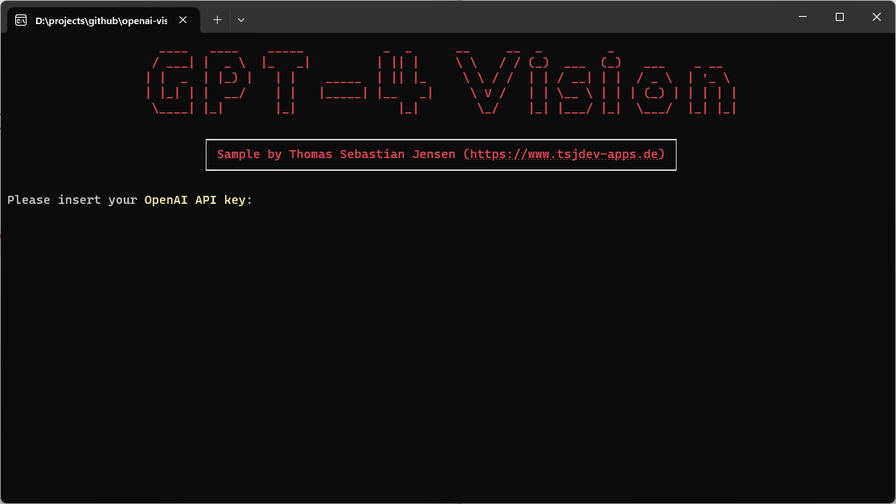
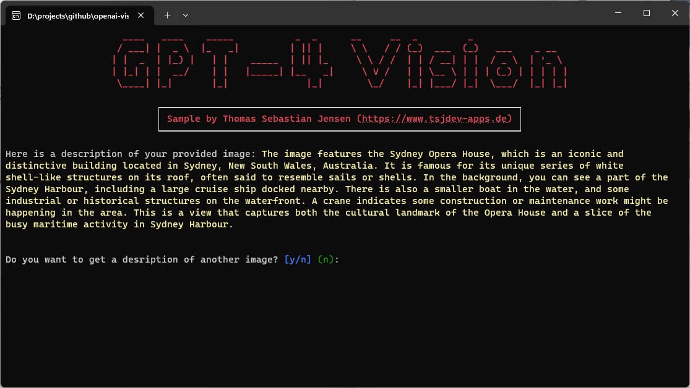

# Vision (Image Description) with OpenAI

This repository contains a simple console application written in .NET 8 to demonstrate how to use the Text-To-Speech API by [OpenAI](https://openai.com) to generate a MP3 file from a text.

## Usage

You need to create an OpenAI account on this [website](https://platform.openai.com/docs/overview). You have to pay to use the API so make sure that you add your payment information. After that, you can create an API Key [here](https://platform.openai.com/api-keys) for further use.

Just run the app and follow the steps displayed on the screen.

## Screenshots

Here you can see the console application in action:

For a try I'm using the following image which was taken by me during my stay in Sydney, Australia.

Here is the result from the *Vision/Completions* API.

#### The image features the Sydney Opera House, which is an iconic and distinctive building located in Sydney, New South Wales, Australia. It is famous for its unique series of white shell-like structures on its roof, often said to resemble sails or shells. In the background, you can see a part of the Sydney Harbour, including a large cruise ship docked nearby. There is also a smaller boat in the water, and some industrial or historical structures on the waterfront. A crane indicates some construction or maintenance work might be happening in the area. This is a view that captures both the cultural landmark of the Opera House and a slice of the busy maritime activity in Sydney Harbour.

## Blog Post

If you are more interested into details, please see the following [medium.com](https://www.medium.com) post:

- [Use OpenAI’s Vision API to get a description of an image](https://medium.com/medialesson/use-openais-vision-api-to-get-a-description-of-an-image-7c6446f56c25)